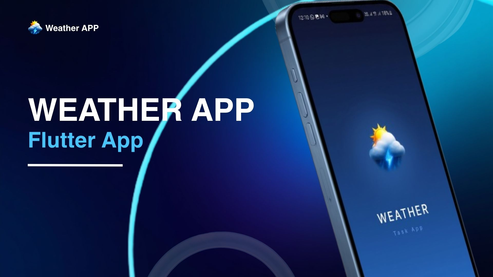
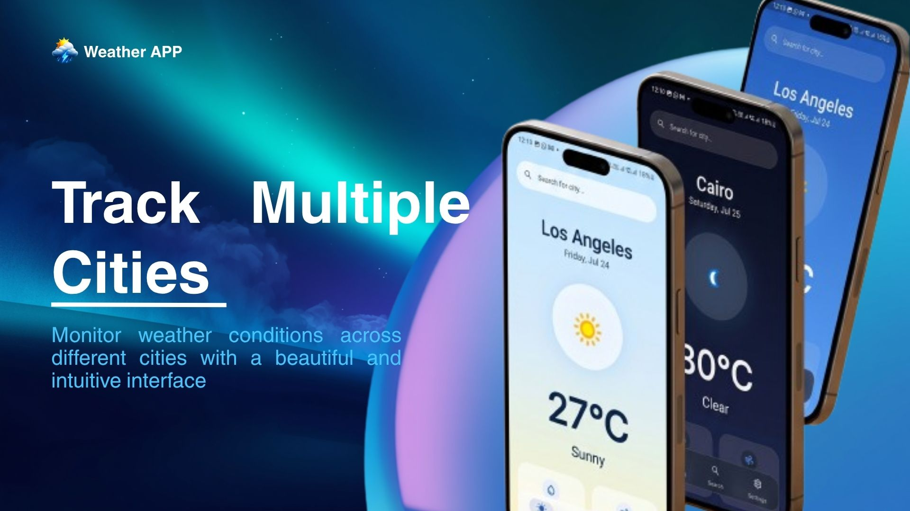
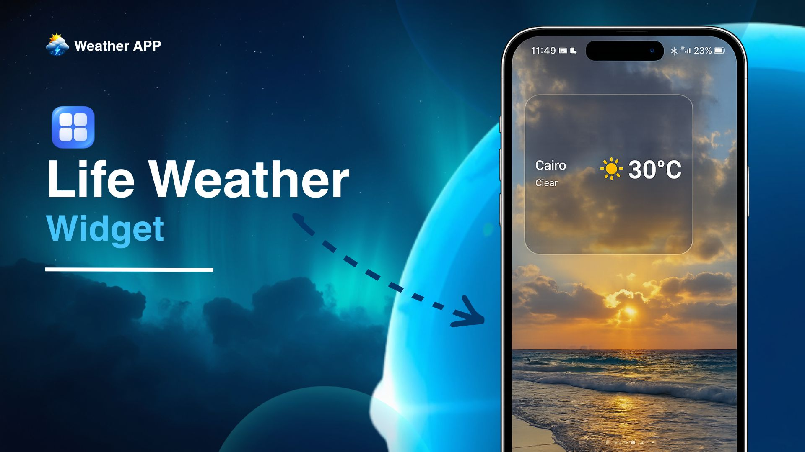
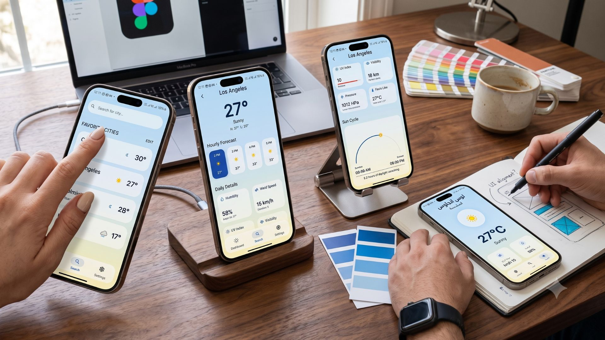

<div align="center">



<br/>

<h1>
  ⛅ Weather Task App
</h1>

<p align="center">
  <strong>A production-grade Flutter weather application built with Clean Architecture, BLoC state management, and a pixel-perfect adaptive UI — featuring real-time weather data, multi-city tracking, home screen widgets, and full localization support.</strong>
</p>

<br/>

<p align="center">
  
  
  
  
  
  
  
</p>

<br/>

</div>

---

## 📸 App Showcase

<div align="center">

<table>
  <tr>
    <td align="center" width="50%">
      
      <br/>
      <sub><b>🌟 Splash Screen</b></sub>
    </td>
    <td align="center" width="50%">
      
      <br/>
      <sub><b>🏙️ Multi-City Tracking</b></sub>
    </td>
  </tr>
  <tr>
    <td align="center" width="50%">
      
      <br/>
      <sub><b>📱 Live Home Screen Widget</b></sub>
    </td>
    <td align="center" width="50%">
      
      <br/>
      <sub><b>🎨 Full UI Design Overview</b></sub>
    </td>
  </tr>
</table>

</div>

---

## ✨ Features at a Glance

| Feature | Description |
|---|---|
| 🌍 **Multi-City Tracking** | Add unlimited cities and monitor their weather at a glance from a clean, organized dashboard |
| 🔍 **Smart City Search** | Debounced real-time search powered by the WeatherAPI.com autocomplete engine |
| 📊 **Rich Weather Details** | Hourly forecast, daily high/low, humidity, UV index, wind speed & direction, pressure, visibility, and cloud cover |
| ☀️ **Sun Cycle Visualization** | Animated arc chart visualizing sunrise/sunset with live daylight hours remaining |
| 📱 **Home Screen Widget** | Native Android & iOS widget refreshed via WorkManager every 15 minutes — always up-to-date, zero interaction needed |
| 🌙 **Dark / Light Theme** | Fully adaptive theme system with smooth transitions and weather-based dynamic gradients |
| 🌐 **Bilingual (EN / AR)** | Full Arabic & English localization including RTL layout support via `easy_localization` |
| 🌡️ **Unit Preferences** | Toggle between Celsius/Fahrenheit and km/h / mph — persisted across sessions |
| 📶 **Offline Awareness** | Graceful connectivity detection with user-friendly fallback states |
| 🎨 **Weather-Adaptive UI** | Background gradients dynamically shift based on weather condition and time of day |
| 💉 **Dependency Injection** | 100% constructor-injected dependencies via `injectable` + `get_it` for maximum testability |

---

## 🏗️ Architecture

This app is engineered following **Clean Architecture** principles with a strict separation between layers. Every feature is self-contained and independently testable.

```
lib/
├── core/                          # Shared cross-feature infrastructure
│   ├── base/                      # Abstract base classes (Use Cases, Repositories)
│   ├── constants/                 # API keys, app-wide constants
│   ├── di/                        # Dependency injection configuration (get_it + injectable)
│   ├── error/                     # Failure models & exception handling (dartz Either)
│   ├── extensions/                # BuildContext extensions (theme, localization, colors)
│   ├── helper/                    # Utility helpers
│   ├── localization/              # Language cubit + translation keys
│   ├── network/                   # Dio client factory, interceptors, connectivity checker
│   ├── routers/                   # GoRouter configuration with custom page transitions
│   ├── settings/                  # App-wide settings cubit (units, preferences)
│   ├── theme/                     # Light/Dark theme definitions + WeatherThemeHelper
│   ├── utils/                     # Shared utilities
│   ├── weather/                   # Shared weather domain (entity, repository contract, use cases)
│   └── widgets/                   # Reusable UI components (loading indicators, etc.)
│
├── features/
│   ├── splash/                    # Animated splash screen
│   ├── weather_dashboard/         # Favorite cities list — domain + presentation
│   ├── weather_details/           # Full weather detail screen — hourly, grid, sun cycle
│   ├── weather_search/            # City search — data + domain + presentation
│   └── weather_settings/          # Settings page — unit toggles, theme, language
│
└── main.dart                      # App entry point — WorkManager init, DI, localization bootstrap
```

### 🔄 Data Flow

```
UI (Widgets) → Cubit (Presentation) → Use Case (Domain) → Repository (Domain Contract)
                                                                     ↕
                                                         Repository Impl (Data Layer)
                                                                     ↕
                                                        Remote (Dio / WeatherAPI.com)
                                                        Local  (SharedPreferences)
```

---

## 🧩 Tech Stack

### Core Framework
| Package | Version | Purpose |
|---|---|---|
| `flutter` | SDK | Cross-platform UI framework |
| `dart` | ^3.10.4 | Language runtime |

### State Management
| Package | Version | Purpose |
|---|---|---|
| `flutter_bloc` | ^9.1.1 | BLoC / Cubit pattern for predictable state |
| `equatable` | ^2.0.5 | Value equality for BLoC states |

### Networking & Data
| Package | Version | Purpose |
|---|---|---|
| `dio` | ^5.7.0 | HTTP client with interceptors & error handling |
| `dartz` | ^0.10.1 | Functional programming — `Either<Failure, Data>` |
| `connectivity_plus` | ^7.3.0 | Real-time network connectivity monitoring |
| `cached_network_image` | ^3.4.1 | Efficient image caching for weather icons |

### Local Storage & Background
| Package | Version | Purpose |
|---|---|---|
| `shared_preferences` | ^2.5.5 | Persisting user settings & favorite cities |
| `home_widget` | ^0.9.3 | Native home screen widget integration |
| `workmanager` | ^0.9.0+3 | Background task scheduling (widget refresh every 15 min) |

### UI & Navigation
| Package | Version | Purpose |
|---|---|---|
| `go_router` | ^14.2.7 | Declarative routing with custom page transitions |
| `flutter_screenutil` | ^5.9.3 | Responsive layout scaling |
| `toastification` | ^3.2.0 | Elegant in-app toast notifications |
| `flutter_spinkit` | ^5.2.2 | Loading animation indicators |
| `device_preview` | ^1.3.1 | Multi-device UI previewing in debug mode |

### Localization
| Package | Version | Purpose |
|---|---|---|
| `easy_localization` | ^3.0.8 | Runtime locale switching (EN / AR) |

### Dependency Injection
| Package | Version | Purpose |
|---|---|---|
| `get_it` | ^8.0.2 | Global service locator |
| `injectable` | ^3.0.0 | Code-generated DI annotations |

### Fonts
- **Inter** — Primary UI font (variable weight)
- **Roboto** — Secondary / body font
- **ScriptMT Bold** — Decorative display font

---

## 📱 Screens & Navigation

The app uses **GoRouter** for declarative, type-safe navigation with custom animated transitions.

```
/                  → SplashView        (Animated intro)
/home              → MainNavigationView (Tab navigation: Dashboard · Search · Settings)
  ├── Dashboard    → Favorite cities list with live weather tiles
  ├── Search       → City search with debounced suggestions
  └── Settings     → Units, theme, language preferences
/details           → WeatherDetailsView (Full details with custom slide+fade transition)
```

---

## 📊 Weather Details Screen

The details screen is one of the most feature-rich screens in the app:

- **Dynamic Background Gradient** — shifts based on condition (sunny, cloudy, rainy, night) using `WeatherThemeHelper`
- **Hourly Forecast Strip** — horizontally scrollable 24-hour forecast with weather icons
- **Daily Details Grid** — cards for Humidity, Wind Speed, UV Index, Visibility, Pressure, Feels Like
- **Sun Cycle Arc Card** — animated progress arc showing current sun position between sunrise and sunset, with daylight hours remaining

---

## 📱 Home Screen Widget

The app ships a **native home screen widget** for both Android and iOS:

- Displays: **City name · Temperature · Condition**
- Auto-refreshes every **15 minutes** via `WorkManager` (even when the app is closed)
- Respects the user's selected **temperature unit** (°C / °F)
- Falls back gracefully to last known data when offline
- Zero battery drain — uses constraint-based scheduling (`networkType: connected`)

---

## 🌐 Localization

Full bilingual support with runtime switching — no app restart required.

| Locale | Language | Layout |
|---|---|---|
| `en` | English | LTR |
| `ar` | Arabic | RTL |

All UI strings are externalized in `assets/translations/` via `easy_localization`. The `LanguageCubit` persists the selected locale across sessions.

---

## ⚙️ Getting Started

### Prerequisites

- Flutter SDK `≥ 3.10.4`
- Dart SDK `≥ 3.0.0`
- A free API key from [WeatherAPI.com](https://www.weatherapi.com/)

### 1. Clone the repository

```bash
git clone https://github.com/MohamedEhab17/Weather-Task-App.git
cd weather_task_app
```

### 2. Configure your API key

Open `config.json` in the root and add your WeatherAPI key:

```json
{
  "api_key": "YOUR_WEATHERAPI_KEY_HERE"
}
```

### 3. Install dependencies

```bash
flutter pub get
```

### 4. Run code generation (DI)

```bash
dart run build_runner build --delete-conflicting-outputs
```

### 5. Run the app

```bash
flutter run
```

---

## 🗂️ Project Structure Highlights

### Clean Architecture Layers Per Feature

```
weather_search/
├── data/
│   ├── datasources/      # Remote data sources (Dio API calls)
│   ├── models/           # JSON serialization models
│   └── repositories/     # Repository implementations
├── domain/
│   ├── entities/         # Pure Dart business objects
│   ├── repositories/     # Abstract contracts
│   └── usecases/         # Single-responsibility use cases
└── presentation/
    ├── cubit/            # BLoC Cubits + States
    ├── views/            # Screen widgets
    └── widgets/          # Screen-specific widget components
```

### Dependency Injection

All dependencies are registered and injected via `@injectable` annotations. Simply run `build_runner` and `get_it` handles the rest — no manual wiring, fully testable in isolation.

### Error Handling

Every use case returns `Either<Failure, T>` from `dartz`. Network errors, server errors, and cache errors are modeled as typed `Failure` subclasses and mapped cleanly through the layers to the UI.

---

## 🎨 Theme System

The app features a robust theming system beyond simple light/dark switching:

- `AppTheme.lightTheme` / `AppTheme.darkTheme` — full `ThemeData` definitions
- `WeatherThemeHelper.getBackgroundGradient()` — returns context-aware gradient based on weather condition + day/night state
- `ThemeCubit` — persists user theme preference via `SharedPreferences`
- Extension methods on `BuildContext` for ergonomic theme access:  
  `context.ext.colors.textPrimary`, `context.text.titleMedium`, etc.

---

## 🔌 API Integration

Powered by **[WeatherAPI.com](https://www.weatherapi.com/)** — providing:

| Endpoint | Data |
|---|---|
| `/current.json` | Live temperature, condition, wind, humidity, UV, pressure, visibility |
| `/forecast.json` | Hourly forecast, daily high/low, astro data (sunrise/sunset) |
| `/search.json` | City autocomplete suggestions |

All API calls go through a centralized **Dio client** with:
- Auth interceptors (API key injection)
- Logging interceptors (debug mode)
- Typed error handling via `DioException`

---

## 🤝 Contributing

Contributions, issues, and feature requests are welcome!

1. Fork the repo
2. Create your feature branch: `git checkout -b feature/amazing-feature`
3. Commit your changes: `git commit -m 'feat: add amazing feature'`
4. Push to the branch: `git push origin feature/amazing-feature`
5. Open a Pull Request

---

## 📄 License

This project is for educational and demonstration purposes.

---

<div align="center">

**Built with ❤️ using Flutter**

*Clean Architecture · BLoC · GoRouter · WorkManager · Easy Localization*

</div>
